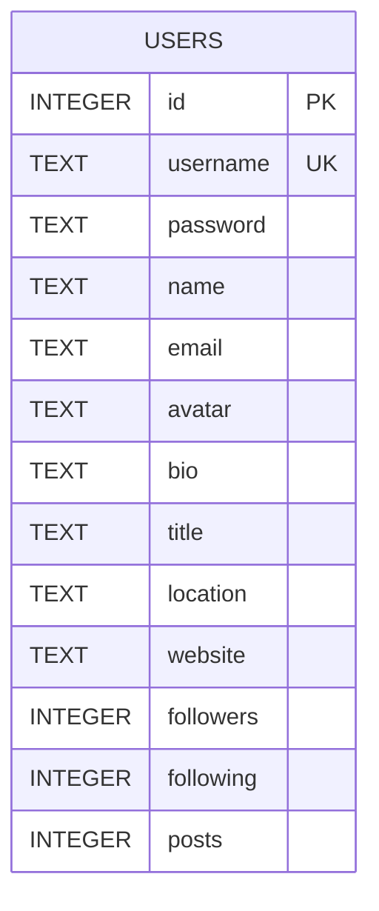
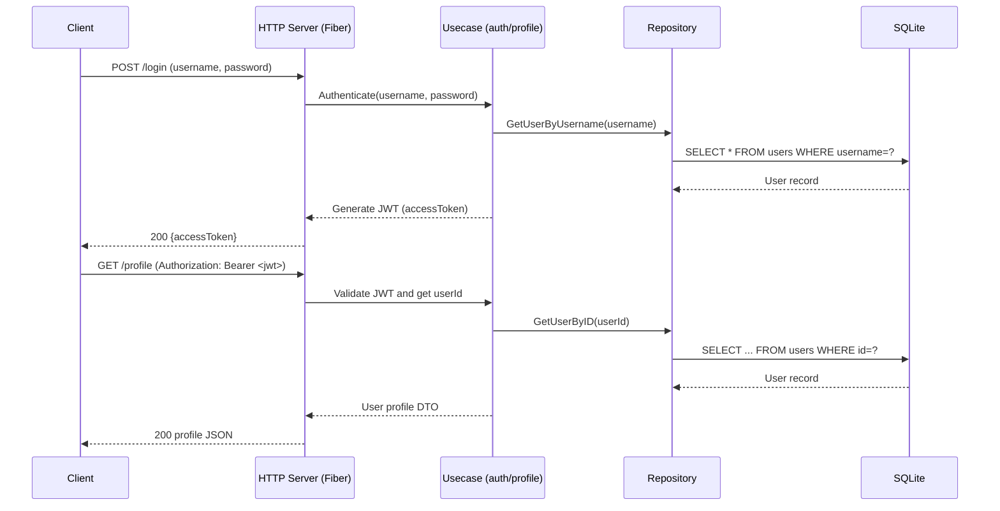

# go-fiber clean architecture sample

Prompt

```
@https://github.com/mikelopster/ai-workshop/blob/main/workshop-4/screenshot/profile.png 

Please read this image add add API detail below

- Init sqlite for support below logic
- Create middleware for authenticate using jwt token (only accessToken without refreshToken)
- Create API for get data in `profile.png`
- still use clean-arch
```

## Run

```bash
JWT_SECRET=dev-secret go run ./cmd/server
```

## Endpoints

- POST `/login`
  - body: `{ "username": "demo", "password": "password" }`
  - resp: `{ "accessToken": "<jwt>" }`
- GET `/profile` (protected)
  - header: `Authorization: Bearer <jwt>`
  - resp example:
    ```json
    {
      "id": 1,
      "username": "demo",
      "name": "Demo User",
      "email": "demo@example.com",
      "avatar": "https://i.pravatar.cc/150?img=3",
      "bio": "Hello, I'm a demo user"
    }
    ```
- GET `/hello-world`
  - resp: `{ "message": "hello world" }`

## Graceful shutdown
- SIGINT/SIGTERM triggers `ShutdownWithContext` with 5s timeout.

## Notes
- SQLite file: `app.db` (auto-created)
- Seed user: `demo` / `password`





Notes:
- USERS is the single table used (JWT is stateless, no refresh tokens stored).
- Column types follow SQLite affinity.
- `username` is unique; `id` is the primary key.
