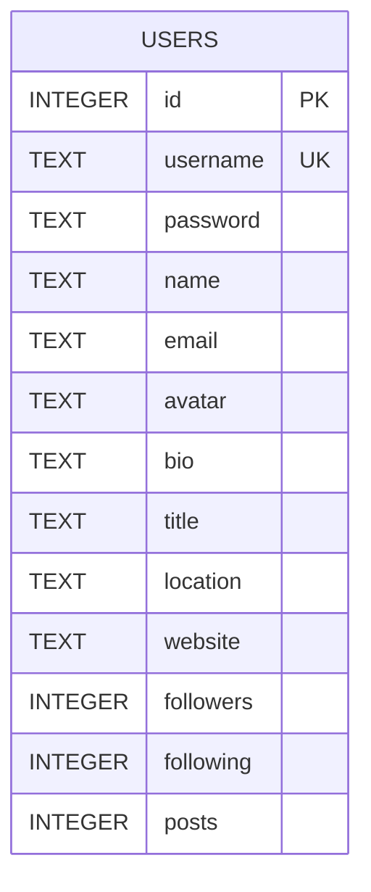

### Database ER Diagram

Notes:
- USERS is the single table used (JWT is stateless, no refresh tokens stored).
- Column types follow SQLite affinity.
- `username` is unique; `id` is the primary key.
